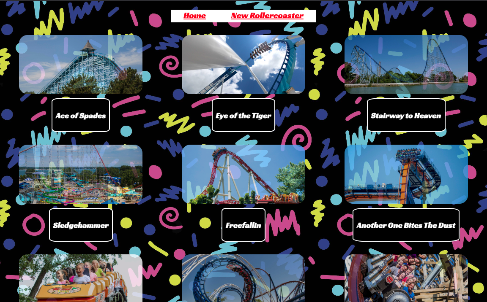
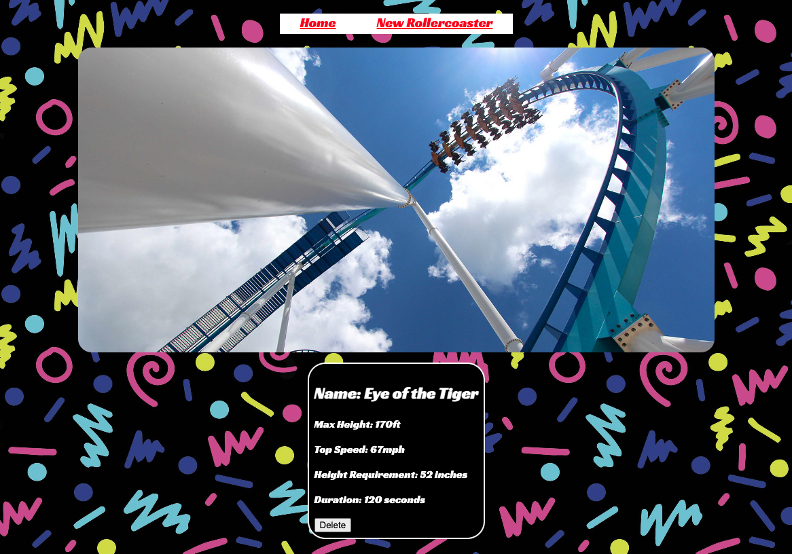
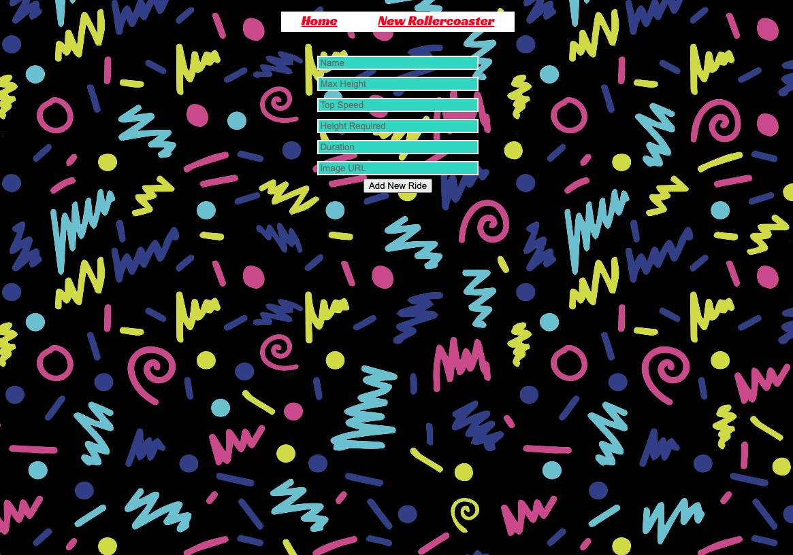

# Rock-n-roller-coasters

## Date: 10/31/2022

### Authors: Jaelen Venable, David Caldwell, Jeff Carroll, Amaya Lucas

### [Heroku](https://rock-n-rollercoaster.herokuapp.com/) | [Trello](https://trello.com/b/6L5061J9/rock-n-rollercoasters) | [GitHub](https://github.com/ajluc/Rock-n-roller-coasters)

---

### **_Description_**

This project is a full-stack web application cataloguing the roller coasters at the Rock and Rollercoaster themepark.

---

### **_Technologies Used_**

1. MongoDB Database
2. Mongoose Express Back-end
3. React.js Front-end
4. Javascript
5. HTML
6. CSS
7. Heroku

---

### **_Getting Started_**

On the homepage users will find a list of rollercoasters at the park. Clicking the image will take the user to a new page with the details of that ride. A navigation bar at the top of the page directs the user back to the home page, or to a form to add a new rollercoaster.

---

### **_Screenshots_**

Home Page:

Details:

Add Rollercoaster:

---

### **_Tasks_**

- [x] Deploy on Heroku
- [] Add mp3's to play on each ride's details page
- [] Expand outside of rollercoasters to other park attractions
- [] Implement search function

---

### **_Credits_**

Roller Coaster Images and Info: [Cedar Point](https://www.cedarpoint.com/)

Carpet Image: [Reddit user u/fredbob107](https://www.reddit.com/r/nostalgia/comments/e4ugn3/90s_arcade_carpet/)

FavIcon Image: [freepik.com](https://www.freepik.com/free-vector/kids-rollercoaster-rides-boy-girl-riding-fast-rollercoaster_2238488.htm#query=rollercoaster%20cartoon&position=0&from_view=keyword)

Flexbox Guide: [CSS-Tricks](https://css-tricks.com/snippets/css/a-guide-to-flexbox/)
